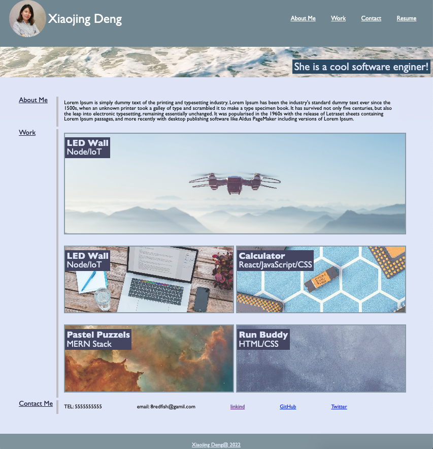

As a potential employee.
I want to show my portfolio to my future employer.
So that they can review samples ot my work and assess whether I am a good candidate for their open position.

When they load my portfolio, my name and photo are presented. Also, there are links to sections about my work and how to contact me. 

When they hover their mouse on the navigation menu, then each link will light up.

When they click on the link in the navigation, then the UI scrolls to the corresponding section.

When they click on the link to the section about my work, then the UI scrolls to a section with titled images of my applications.

My first application image is larger in size than the others.

When they click on each application's image, it will take them to that deployed application.

When they resize the page or view the site on various screens and devices, my site is presented with a responsive layout that adapts to their viewport.

link: https://xiaojing168jmg168.github.io/my-portfolio/

